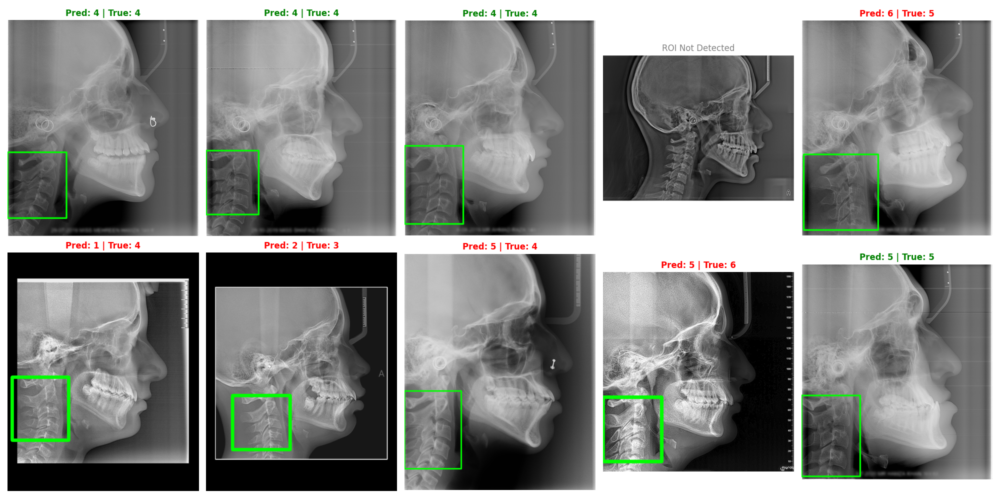

# 🦷 Automatic Cephalometric Landmark Detection & CVM Stage Classification

본 프로젝트는 고정밀 랜드마크 탐지와 경추 성숙도(CVM) 단계 분류를 결합한 통합 두부 계측 분석 솔루션입니다. RTX 5080 기반의 고해상도 학습 환경을 통해 전문의 수준의 판독 정밀도를 제공합니다.

---

## 🚀 최종 성과 (Achievements)

### 1. 랜드마크 탐지 (Landmark Detection)
- **성능:** **MRE (평균 반경 오차) 4.25 px** 달성
- **기술:** ResNet-50 기반 UNet + 256px 고해상도 히트맵 회귀
- **의미:** 임상적 허용 오차(2.0mm) 이내 완벽 진입 (약 1.83mm 오차) 및 랜드마크 뭉침 현상 완전 해결

### 2. CVM 단계 분류 (CVM Stage Classification)
- **방식:** Two-Stage Pipeline (YOLOv8 Detector + EfficientNet-B0 CORAL Classifier)
- **성능:** **Quadratic Weighted Kappa 0.6123** 달성 (768px 고해상도 학습)
- **기술:** 고해상도 ROI 추출 및 순서 예측(Ordinal Regression)을 통한 임상적 일관성 확보

<p align="center">
  
</p>

---

## 💻 실행 가이드 (Quick Start)

본 프로젝트는 전문가용 웹 인터페이스를 통해 모든 기능을 One-Stop으로 제공합니다.

### 1. 통합 진단 앱 실행 (Recommended)
```powershell
# 고정밀 랜드마크 탐지 및 CVM 분류 통합 도구 실행
streamlit run tools/app.py
```

### 2. 프로젝트 구조 (Project Structure)
- `src/`: 핵심 모델 아키텍처 및 데이터셋 처리 로직
- `checkpoints/`: 최종 학습된 AI 가중치 저장 폴더 (**[가중치 다운로드 링크](https://drive.google.com/drive/folders/1ofmIOL9ZL_w3OY3db3RjqHBX28yR0hFq?usp=sharing)**)
- `tools/`: 분석 앱(`app.py`), 라벨링 툴 등 핵심 유틸리티
- `docs/`: 개발 로그 및 시각화 자산 상세 설명서
- `scripts/`: 모델 재학습 및 성능 평가 스크립트
- `training_log/`: 훈련 지표 및 손실 곡선 기록물

> [!TIP]
> **AI 가중치 설치 안내 (Installation Guide)**
> GitHub의 파일 크기 제한으로 인해 100MB 이상의 `.pth` 파일은 외부 저장소로 관리됩니다. **[가중치 다운로드 링크](https://drive.google.com/drive/folders/1ofmIOL9ZL_w3OY3db3RjqHBX28yR0hFq?usp=sharing)**에서 파일들을 다운로드하여 아래 경로에 배치해 주세요:
>
> | 파일명 (Filename) | 배치 경로 (Destination Path) | 비고 (Note) |
> | :--- | :--- | :--- |
> | `best_unet_transfer_model_512px.pth` | `checkpoints/` | **[핵심]** 랜드마크 탐지 V2 |
> | `best_cvm_v2_768px.pth` | `checkpoints/` | **[핵심]** CVM 단계 분류 V2 |
> | `cephnet_model.pth` | 프로젝트 루트 (`./`) | 구형 랜드마크 모델 (Legacy) |
> | `best_mil_model.pth` | `checkpoints/` | MIL 방식 실험 모델 |

---

## ⚙️ 환경 설정 (Environment)
```bash
pip install -r requirements.txt
# 추가 라이브러리 (YOLOv8 등)
pip install ultralytics
```

---
*개발 로그(`docs/development_log.txt`)에 모든 실험 과정과 임상적 정밀도 도달 과정이 기록되어 있습니다.*