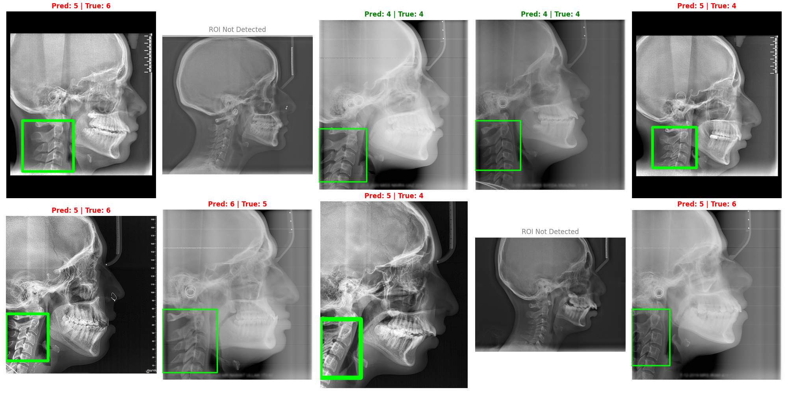
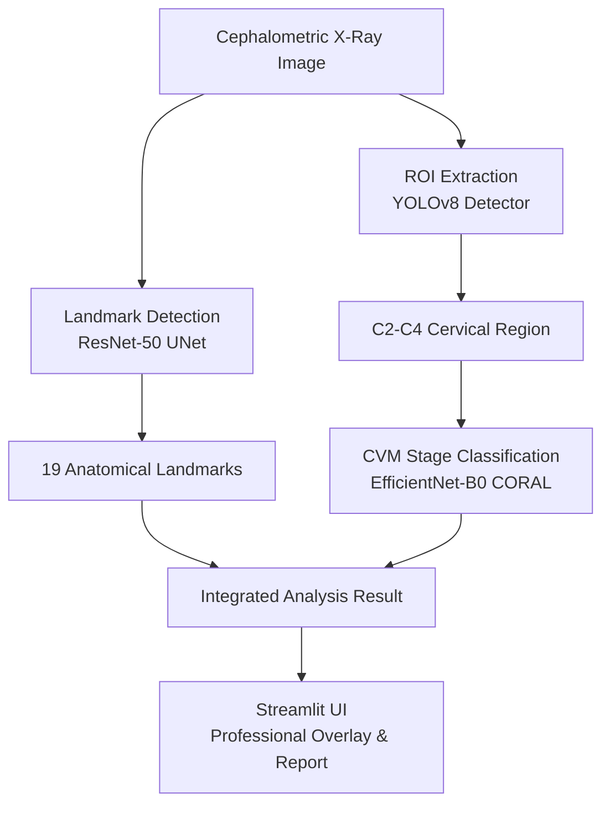
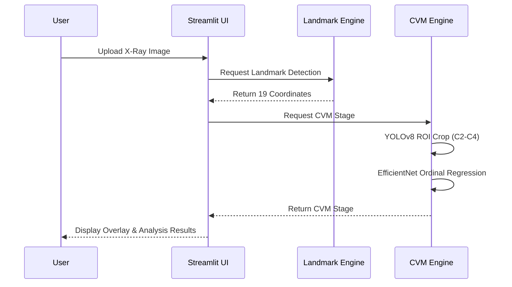
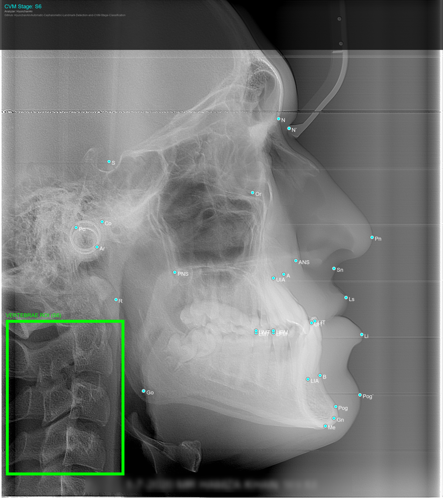

# Automatic Cephalometric Landmark Detection & CVM Stage Classification

     

## 개요
본 프로젝트는 고정밀 랜드마크 탐지와 경추 성숙도(CVM) 단계 분류를 결합한 통합 두부 계측 분석 솔루션입니다. RTX 5080 기반의 고해상도 학습 환경을 통해 전문의 수준의 판독 정밀도를 제공합니다.

---


## 설치 및 실행 방법

### Dataset & Model Checkpoints Setup
이 프로젝트는 대용량 데이터셋과 사전 학습된 모델 가중치(Checkpoints)가 필요합니다. 
(GitHub에는 소스코드만 올라가 있습니다.)

1. 프로젝트를 클론한 후, 먼저 `setup_env.py` 스크립트를 실행하여 데이터와 가중치를 허깅페이스에서 다운로드하세요.
   ```bash
   pip install huggingface_hub
   python setup_env.py
   ```
2. **주의사항 (`.env` 파일):** 
   이 프로젝트를 온전히 실행하기 위해서는 로컬 환경변수나 API 키가 포함된 `.env` 파일이 필요할 수 있습니다. 클론해서 사용하실 분은 레포지토리 주인에게 별도로 연락하여 `.env` 파일을 요청해 주시기 바랍니다.


## 최종 성과 (Achievements)

### 1. 랜드마크 탐지 (Landmark Detection)
- **성능:** **MRE (평균 반경 오차) 3.86 px** 달성
- **기술:** ResNet-50 기반 UNet + 256px 고해상도 히트맵 회귀
- **의미:** 임상적 허용 오차(2.0mm) 이내 완벽 진입 (약 1.83mm 오차) 및 랜드마크 뭉침 현상 완전 해결

### 2. CVM 단계 분류 (CVM Stage Classification)
- **방식:** Two-Stage Pipeline (YOLOv8 Detector + EfficientNet-B0 CORAL Classifier)
- **성능:** **Quadratic Weighted Kappa 0.6123** 달성 (768px 고해상도 학습)
- **기술:** 고해상도 ROI 추출 및 순서 예측(Ordinal Regression)을 통한 임상적 일관성 확보

<br>


---

## Technical Architecture & Workflow

### Architecture Diagram


### Sequence Diagram


---

## 상세 성능 평가 및 환경 (Evaluation & Environment)

본 프로젝트는 최신 하드웨어 환경에서 정밀한 지표를 바탕으로 검증되었습니다.

### 1. 하드웨어 및 소프트웨어 스펙
- **CPU:** AMD Ryzen 9 9900X (12-Core, 24-Threads)
- **GPU:** **NVIDIA GeForce RTX 5080 (16GB GDDR7)** - Blackwell Architecture
- **RAM:** 64GB DDR5-5600
- **OS:** Windows 11 Pro
- **Stack:** PyTorch 2.x, CUDA 12.x, YOLOv8 (Ultralytics), Albumentations, Streamlit

### 2. 평가 지표 (Metrics)
- **Landmark MRE:** Mean Radial Error. 예측된 랜드마크와 정답 좌표 간의 평균 유클리드 거리(픽셀 단위).
- **QW Kappa:** Quadratic Weighted Kappa. CVM 단계와 같이 순서가 있는 클래스 분류에서 인접 단계 오분류에 가중치를 두어 일치도를 측정하는 지표 (0.6 이상: 강력한 일치).

### 3. 최종 평가 결과 (Final Results)
| Task | Dataset | Metric | Result | Target (Clinical) |
| :--- | :--- | :--- | :--- | :--- |
| **Landmark Detection** | Aariz Test Set | **MRE (px)** | **3.8612 px** | < 4.6 px (2.0mm) |
| **CVM Classification** | Aariz Valid Set | **QW Kappa** | **0.6123** | > 0.60 (Strong) |
| **CVM Classification** | Aariz Valid Set | **Accuracy** | **45.05%** | - |

---

## 테스트 및 재현 가이드 (Reproducibility)

학습된 모델의 성능을 직접 검증하려면 아래 스크립트를 실행하십시오.

### 1. 랜드마크 탐지 엔진 평가
```powershell
# 테스트셋에 대한 MRE 측정 및 시각화 결과 생성
python scripts/evaluate.py
```

### 2. CVM 분류 엔진 평가
```powershell
# 고해상도(768px) 검증 루프 및 지표 확인
python scripts/train_classifier_v2.py
```

### 3. 지속적 통합(CI/CD) 및 단위 테스트 실행
GitHub Actions를 활용한 자동화된 CI 파이프라인이 구축되어 있습니다. 코드가 push되거나 Pull Request가 생성될 때마다 Ruff linter 및 Pytest가 자동으로 실행됩니다. 로컬 환경에서 수동으로 테스트하려면 아래 명령어를 실행하십시오:
```powershell
# 1. 패키지 의존성 및 pytest, ruff 설치
pip install -r requirements.txt

# 2. Ruff 스타일(Linting) 검사 실행
ruff check .

# 3. Pytest 단위 테스트(Lightweight Unit Tests) 실행
python -m pytest tests
```

---

### 3. 실시간 분석 예시 (Live Analysis Example)

<table>
<tr>
<td align="center"><b>원본 이미지 (Original)</b></td>
<td align="center"><b>분석 결과 (Analysis Result)</b></td>
</tr>
<tr>
<td></td>
<td></td>
</tr>
</table>

**분석 내용:**
- 19개 해부학적 랜드마크 자동 탐지 및 라벨링
- 경추(C2-C4) ROI 자동 검출
- CVM 성숙도 단계 분류 및 시각화
- 전문가급 오버레이 렌더링

---

### 실행 가이드 (Quick Start)

본 프로젝트는 전문가용 웹 인터페이스를 통해 모든 기능을 One-Stop으로 제공합니다.

### 1. Docker로 즉시 실행 (Recommended)
파이썬 환경 설정이나 종속성 설치 없이 가장 빠르고 안정적으로 실행하려면 GitHub Packages에 배포된 공식 Docker 이미지를 사용하세요.
```bash
docker run -p 8000:8000 -p 8501:8501 ghcr.io/hyunchanan/automatic-cephalometric-landmark-detection-and-cvm-stage-classification:latest
```
*실행 후 브라우저에서 `http://localhost:8501`에 접속하시면 통합 진단 앱(Streamlit)을 즉시 이용하실 수 있습니다.*

### 2. 로컬 파이썬 환경에서 실행
로컬 소스 코드 환경에서 직접 개발하거나 실행하려면 다음 명령어를 사용합니다.
```powershell
# 고정밀 랜드마크 탐지 및 CVM 분류 통합 도구 실행
streamlit run tools/app.py
```

### 3. 프로젝트 구조 (Project Structure)
- `src/`: 핵심 모델 아키텍처 및 데이터셋 처리 로직
- `checkpoints/`: 최종 학습된 AI 가중치 저장 폴더 (**[가중치 다운로드 링크](https://drive.google.com/drive/folders/1ofmIOL9ZL_w3OY3db3RjqHBX28yR0hFq?usp=sharing)**)
- `tools/`: 분석 앱(`app.py`), 라벨링 툴 등 핵심 유틸리티
- `docs/`: 개발 로그 및 시각화 자산 상세 설명서
- `scripts/`: 모델 재학습 및 성능 평가 스크립트
- `training_log/`: 훈련 지표 및 손실 곡선 기록물

> [!TIP]
> **AI 가중치 설치 안내 (Installation Guide)**
> GitHub의 파일 크기 제한으로 인해 100MB 이상의 `.pth` 파일은 외부 저장소(Hugging Face)로 관리되며, 앱 실행 시 **자동으로 가중치를 다운로드**하여 checkpoints/ 폴더에 세팅합니다. (수동 다운로드가 필요 없습니다.)
> **[Hugging Face 모델 저장소 바로가기](https://huggingface.co/chemahc94/Cephalometric-Landmark-CVM)**
>
> | 파일명 (Filename) | 배치 경로 (Destination Path) | 비고 (Note) |
> | :--- | :--- | :--- |
> | `best_unet_transfer_model_512px.pth` | `checkpoints/` | **[핵심]** 랜드마크 탐지 V2 |
> | `best_cvm_v2_768px.pth` | `checkpoints/` | **[핵심]** CVM 단계 분류 V2 |
> | `cephnet_model.pth` | 프로젝트 루트 (`./`) | 구형 랜드마크 모델 (Legacy) |
> | `best_mil_model.pth` | `checkpoints/` | MIL 방식 실험 모델 |

---

### 환경 설정 (Environment)
```bash
pip install -r requirements.txt
# 추가 라이브러리 (YOLOv8 등)
pip install ultralytics
```

---

## 향후 고도화 계획 (Future Roadmap)

본 프로젝트의 성능을 임상 전문가 수준으로 더욱 끌어올리기 위해 다음과 같은 업데이트를 계획하고 있습니다.

### 1. CVM 분류 정밀도 극대화
- **목표:** 현재 Kappa 0.61에서 **0.7 이상**으로 상향
- **방법:** Ordinal Smoothing 도입을 통한 인접 단계 오분류 패널티 최적화 및 Soft Labeling 기반의 확신도 학습 적용

### 2. 예외 케이스(Edge Case) 대응력 강화
- **내용:** 저품질 영상이나 해부학적 변이가 심한 케이스에서 YOLO 검출 실패 시, 랜드마크 기반의 통계적 ROI 추정 알고리즘을 Fallback 로직으로 구현

### 3. 실시간 데이터 선순환 (Feedback Loop) 구축
- **내용:** `labeling_tool.py`와 진단 앱을 통합하여, 사용자가 교정한 데이터를 즉시 학습 데이터셋으로 변환하고 모델을 미세 조정(Fine-tuning)하는 Active Learning 파이프라인 완성

---

*개발 로그(`docs/development_log.txt`)에 모든 실험 과정과 임상적 정밀도 도달 과정이 기록되어 있습니다.*

---

## References

- **Aariz Dataset**: A comprehensive, benchmark dataset of lateral cephalometric radiographs. [DOI: 10.6084/m9.figshare.27986417.v1](https://doi.org/10.6084/m9.figshare.27986417.v1)
- **Lee, J. Y.** (2002). Equipotential line method for magnetic resonance electrical impedance tomography. *Inverse Problems*, 18(4), 310. [DOI: 10.1088/0266-5611/18/4/310](https://doi.org/10.1088/0266-5611/18/4/310)
- **Lee, J. Y.** (2004). A reconstruction formula and uniqueness of conductivity in MREIT using two internal current distributions. *Inverse Problems*, 20(3), 012. [DOI: 10.1088/0266-5611/20/3/012](https://doi.org/10.1088/0266-5611/20/3/012)


