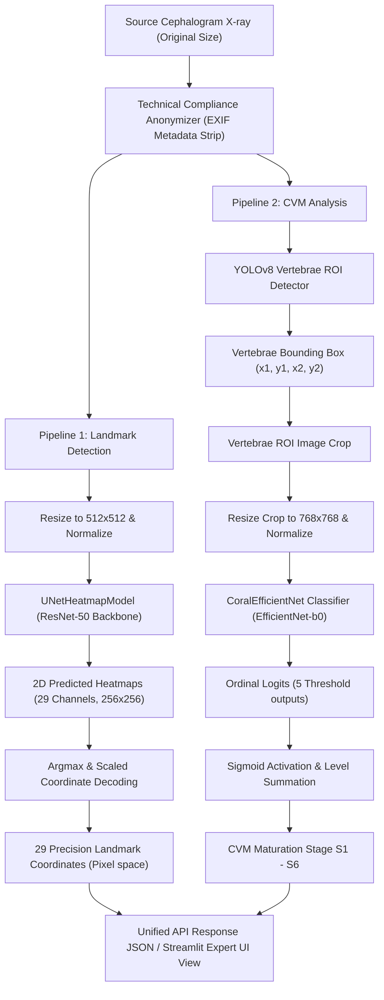

# CephAI Pro: System Architecture

본 문서는 CephAI Pro 진단 엔진의 구조적 아키텍처 및 복합 신경망 추론 파이프라인의 설계 사상을 설명합니다. 본 프로젝트는 두개골 측모 X-ray 영상을 입력받아, 정밀 랜드마크 검출(Landmark Detection)과 경추 골성숙도 단계 분류(CVM Stage Classification)를 동시에 수행하는 복합 ML 구조를 취하고 있습니다.

## 1. System Pipeline Overview

시스템 파이프라인은 크게 3개의 신경망 블록으로 이루어져 유기적으로 작동합니다.

---

## 2. Neural Network Components Detail

### 2.1 Landmark Localization Engine: UNetHeatmapModel
- <b>구조</b>: 인코더로 이미지넷 가중치 기반의 ResNet-50 백본을 차용하고, 디코더에 전치합성곱(Transpose Convolution) 블록 및 추가 업샘플링 모듈을 설계한 UNet 변형 모델입니다.
- <b>입력 규격</b>: 512 x 512 픽셀 RGB 이미지.
- <b>출력 규격</b>: 256 x 256 크기의 29채널 히트맵 텐서. 각 채널은 해당 랜드마크의 존재 확률 공간 분포를 나타냅니다.
- <b>후처리 (Coordinate Decoding)</b>: 256x256 크기 히트맵의 최대 활성화 픽셀 좌표(Argmax)를 구한 뒤, 원본 해상도의 종횡비(Ratio)에 맞추어 역스케일링하여 실제 원본 픽셀 좌표계로 복원합니다.

### 2.2 Cervical Vertebrae ROI Detector: YOLOv8
- <b>구조</b>: 비정형 X-ray 이미지에서 2번째(C2), 3번째(C3), 4번째(C4) 경추 영역만을 분리하기 위한 고성능 Bounding Box Detector 객체 검출 모델입니다.
- <b>수행 역할</b>: 측모 X-ray 이미지 내에서 경추 뼈 영역을 정확히 포착(Vertebrae ROI)하고 좌표값(BBox)을 생성하여 EfficientNet의 분류 오차를 최소화하는 공간 격리 장벽 역할을 합니다.

### 2.3 CVM Classifier: CoralEfficientNet
- <b>구조</b>: EfficientNet-B0를 백본으로 하고, 출력층에 CORAL(Consistent Rank Logits) 레이어를 적용하여 순서형 회귀(Ordinal Regression) 연산을 수행하도록 특수 커스터마이징된 신경망 모델입니다.
- <b>입력 규격</b>: YOLOv8이 포착한 경추 ROI를 크롭하여 768 x 768 해상도로 보간 및 표준화한 이미지.
- <b>순서형 분류 연산</b>: 6단계의 CVM 단계를 예측하기 위해 5개의 출력 노드를 두며, 각 노드는 <i>"특정 단계 이상일 확률"</i>을 시그모이드 임계치로 도출하고 이들을 합산하여 최종 성숙도를 결정론적으로 판단합니다.

---

## 3. Directory Layout & Architecture Principles

본 프로젝트의 패키지 레이아웃은 관심사 분리(Separation of Concerns, SoC)와 파이썬 공식 표준 규격을 준수합니다.

- <b>src/</b>: 핵심 추론 및 모델 학습에 사용되는 핵심 소스코드 레이어.
  - [src/config.py](file:///e:/Github/Automatic-Cephalometric-Landmark-Detection-and-CVM-Stage-Classification/src/config.py): 랜드마크 명칭, 심볼, 임상적 오차 검증 범위 등의 글로벌 고정 변수 관리.
  - [src/model.py](file:///e:/Github/Automatic-Cephalometric-Landmark-Detection-and-CVM-Stage-Classification/src/model.py): UNetHeatmapModel 등 학습/추론 모델 설계도 분리.
  - [src/dataset.py](file:///e:/Github/Automatic-Cephalometric-Landmark-Detection-and-CVM-Stage-Classification/src/dataset.py): 이미지 및 정밀 데이터 증강(Albumentations) 파이프라인.
- <b>tools/</b>: 사용자 및 시스템 외부 소통 접점 어플리케이션 레이어.
  - [tools/app.py](file:///e:/Github/Automatic-Cephalometric-Landmark-Detection-and-CVM-Stage-Classification/tools/app.py): 전문가용 Streamlit 기반 리치 웹 UI 분석 대시보드.
  - [tools/api.py](file:///e:/Github/Automatic-Cephalometric-Landmark-Detection-and-CVM-Stage-Classification/tools/api.py): 의료 정보 시스템(PACS 등)을 위한 무보존(Zero-Storage) 비식별 REST API 서버.
- <b>tests/</b>: 80% 이상의 품질 보증 테스트 레이어.
  - [tests/test_model.py](file:///e:/Github/Automatic-Cephalometric-Landmark-Detection-and-CVM-Stage-Classification/tests/test_model.py): 신경망 텐서 흐름 모니터링 단위 테스트.
  - [tests/test_api.py](file:///e:/Github/Automatic-Cephalometric-Landmark-Detection-and-CVM-Stage-Classification/tests/test_api.py): REST API 전처리 및 무보존 파이프라인 통합 테스트.
  - [tests/test_inference.py](file:///e:/Github/Automatic-Cephalometric-Landmark-Detection-and-CVM-Stage-Classification/tests/test_inference.py): 결정론적 재현성 검증 테스트.
