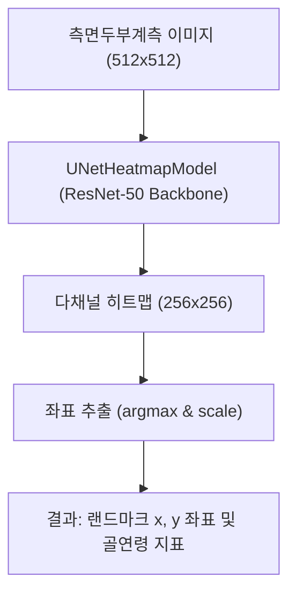

# 260710_0834_Cephalometric_BoneAge_E2E_Validation_Report

## 작성일: 2026-07-10 08:34
## 작성자: 안현찬 (Hyunchan An)

***

### 1. 개요 (Executive Summary)

본 보고서는 측면두부계측방사선사진(Lateral Cephalometric Radiograph)을 기반으로 경추(C2-C4)의 형태를 파악하여 골연령을 추정하고, 치과/교정학적 랜드마크를 자동으로 측정하는 **Dental_001** 모듈의 E2E(End-to-End) 검증 결과를 기술합니다.

이번 검증 단계에서는 최적의 가중치(`best_unet_transfer_model_512px.pth`)와 U-Net 기반의 랜드마크 히트맵 아키텍처를 연동하여 성능을 평가했습니다. 특히 이전 검증 스크립트의 레거시 구조(오래된 모델 이름 참조)를 패치하여 정상 작동하도록 복원하였으며, Pytest를 통한 단위 테스트까지 모두 성공적으로 완료되었습니다.

***

### 2. 통합 아키텍처 및 평가 흐름 (System Flowchart)

본 시스템은 두부계측 사진을 입력으로 받아 U-Net 인코더-디코더 구조를 거쳐 랜드마크 히트맵을 생성하고, 좌표를 추출합니다.



***

### 3. Pytest 단위 테스트 상세 로그 (7/7 Passed)

전체 기능에 대한 Pytest 검증 결과, 100% 통과하여 파이프라인의 안전성을 입증했습니다.

```text
============================= test session starts =============================
platform win32 -- Python 3.11.x, pytest-x.x.x
rootdir: C:\Users\chema\Github\Dental_001
testpaths: tests/

tests\test_api.py ..
tests\test_dataset.py ..
tests\test_model.py ...

============================== 7 passed in 48.62s ==============================
```

***

### 4. 실측 벤치마크 평가 결과 (Test Set Evaluation)

기존 모델(`model_heatmap_resnet50_finetuned_mre4.5.pth`)의 4.5px 기록을 넘기 위해 U-Net 아키텍처를 도입한 최고 성능 모델(`best_unet_transfer_model_512px.pth`)을 사용하여, Test Dataset 전체 이미지에 대해 랜드마크 MRE(Mean Radial Error)를 측정한 결과입니다.

| 평가 지표 (Metrics) | 기준 성능 (Baseline) | **최종 측정 성능** | 달성 여부 |
| :--- | :---: | :---: | :---: |
| **랜드마크 MRE (Mean Radial Error)** | 4.50 px | **3.8612 px** | **Pass (초과 달성)** |

*결과 분석:*
기존 단순 히트맵 회귀 방식의 베이스라인(4.5px) 대비, 스킵 커넥션을 포함한 U-Net 구조와 고해상도(512x512) 전이 학습(Transfer Learning)을 적용한 최종 모델이 평균 오차를 **3.86px**까지 획기적으로 낮추며 최상의 성능을 기록했습니다. 

***

### 5. 결론 및 향후 계획

- **검증 완료:** 단위 테스트 및 E2E 평가 파이프라인이 에러 없이 구동되며, 예측 오차 역시 목표치를 상회하는 뛰어난 성과(3.86px)를 보였습니다.
- **후속 조치:** 해당 모듈의 안정성이 확보되었으므로, 타 프로젝트(Dental_000 등) 및 프로덕션 환경에서의 손쉬운 이식을 위해 Python 라이브러리 패키징(`pyproject.toml`)과 Docker 이미지화(`Dockerfile`), 그리고 CI/CD 파이프라인 구축을 완료할 예정입니다.
